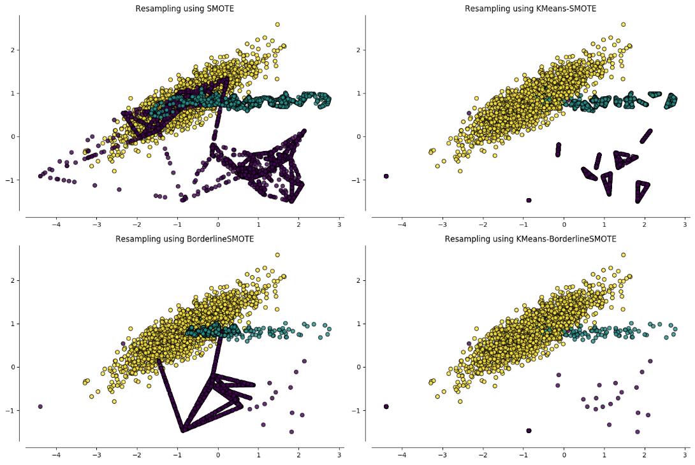

## Introduction

Learning from imbalanced data is a common and challenging problem in supervised
learning. Training a classifier on imbalanced data, often results in a low
out-of-sample accuracy for the minority classes. While different strategies
exist to tackle this problem, the most general approach known as oversampling,
is the generation of artificial data to achieve a balanced class distribution
that in turn are used to enhance the training data.

*SMOTE* algorithm, the most popular oversampler, as well as any other oversampling
method based on it, generates synthetic samples along line segments that join
minority class instances. *SMOTE* addresses only the issue of between-classes
imbalance. On the other hand, by clustering the input space and applying any
oversampling algorithm for each resulting cluster with appropriate resampling
ratio, the within-classes imbalanced issue can be addressed i.e. areas of the
input space that differ significantly in the density of the minority class.
[*SOMO*](https://www.sciencedirect.com/science/article/abs/pii/S0957417417302324) and
[*KMeans-SMOTE*](https://www.sciencedirect.com/science/article/abs/pii/S0020025518304997) 
algorithms are specific realizations of this approach that have been shown to outperform 
other standard oversamplers in a large number of datasets.

A *Python* implementation of *SMOTE* and several of its variants is available in the
[*Imbalanced-Learn*](https://imbalanced-learn.org/stable/) library, which is fully
compatible with the popular machine learning toolbox
[*Scikit-Learn*](https://scikit-learn.org/stable/). I have developed a Python
implementation of the above clustering-based oversampling approach, called 
[*cluster-over-sampling*](https://github.com/georgedouzas/cluster-over-sampling)), that
integrates seamlessly with the *Scikit-Learn* and *Imbalanced-Learn* ecosystems.


## Installation

The easiest way to install the *cluster-over-sampling* package, assuming you
have already *Python 3* and *pip* installed as well as you have optionally
activated a *Python virtual environment*, is to open a shell and run the following
command:

```
pip install cluster-over-sampling
```

This will install the latest version and its basic dependencies. There are also
optional dependencies that can be install by modifying the above command:

```
pip install cluster-over-sampling[optional]
```

## Documentation

Detailed documentation that includes installation guidelines, API description
and various examples can found
[here](https://cluster-over-sampling.readthedocs.io/en/latest/?badge=latest). 

## Functionality

In what follows, I will describe briefly some aspects of
*cluster-over-sampling* functionality. The main addition that
*cluster-over-sampling* provides compared to Imbalanced-Learn is that it includes
the class `ClusterOverSampler`. Its initializer includes the parameters
`oversampler`, `clusterer` and `distributor`. The
first parameter accepts any *Imbalanced-Learn* oversampler while the second
parameter defines the clustering algorithm that is applied
to the input space before oversampling. It can be any *Scikit-Learn* compatible
clusterer. The last parameter should be a distributor object i.e. an instance
of any class that inherits from the `BaseDistributor` class provided by
*cluster-over-sampling*. Such a class is already included and it is called
`DensityDistributor`.

#### Resampling an imbalanced dataset

Let's generate a binary class imbalanced dataset, represented by the input
matrix `X` and the target vector `y`:

```python
# Imports
from sklearn.datasets import make_classification

# Set random seed
rnd_seed = 12

# Generate imbalanced data
X, y = make_classification(
  n_samples=100,
  n_classes=2,
  weights=[0.9, 0.1],
  random_state=rnd_seed
)
```

The following functions extract and print the main characteristics of a binary
class dataset. Specifically, the `extract_characteristics` function returns the
number of samples, the number of features, the labels and the number of samples
for the majority and minority classes as well as the Imbalance Ratio defined as
the ratio between the number of samples of the majority and minority classes,
while the `print_characteristics` function prints them in an appropriate format:

```python
# Imports
from collections import Counter

# Define function to extract dataset's characteristics
def extract_characteristics(X, y):
  n_samples, n_features = X.shape
  count_y = Counter(y)
  (maj_label, n_samples_maj), (min_label, n_samples_min) = count_y.most_common()
  ir = n_samples_maj / n_samples_min
  return n_samples, n_features, maj_label, n_samples_maj, min_label, n_samples_min, ir

# Define function to print dataset's characteristics
def print_characteristics(X, y):
  n_samples, n_features, maj_label, n_samples_maj, min_label, n_samples_min, ir = extract_characteristics(X, y)
  print(
    f'Number of samples: {n_samples}',
    f'Number of features: {n_features}',
    f'Majority class label: {maj_label}',
    f'Number of majority class samples: {n_samples_maj}',
    f'Minority class label: {min_label}',
    f'Number of minority class samples: {n_samples_min}',
    f'Imbalance Ratio: {ir:.1f}',
    sep='\n'
  )
```

I use the above function to print the main characteristics of the generated imbalanced dataset:

```python
# Print imbalanced dataset's characteristics
print_characteristics(X, y)

##########
# Output #
##########

# Number of samples: 100
# Number of features: 20
# Majority class label: 0
# Number of majority class samples: 90
# Minority class label: 1
# Number of minority class samples: 10
# Imbalance Ratio: 9.0
```

 I will create a combination of the *SMOTE* oversampler and the *KMeans* clusterer
 to rebalance the above dataset. This can be constructed by importing `SMOTE`
 oversampler from Imbalanced-Learn, `KMeans` from Scikit-Learn and
 `ClusterOverSampler` from `cluster-over-sampling`. Then following the
 *Imbalanced Learn* API, the `fit_resample` method of the resulting
 clustering-based oversampler can be used to resample the imbalanced dataset:

```python
# Imports
from imblearn.over_sampling import SMOTE
from sklearn.cluster import KMeans
from clover.over_sampling import ClusterOverSampler

# Create KMeans-SMOTE instance
smote = SMOTE(random_state=rnd_seed + 1)
kmeans = KMeans(n_clusters=50, random_state=rnd_seed + 5)
kmeans_smote = ClusterOverSampler(oversampler=smote, clusterer=kmeans)

# Fit and resample imbalanced data
X_res, y_res = kmeans_smote.fit_resample(X, y)
```

Again we can print the main characteristics of the rebalanced dataset:

```python
# Print balanced dataset's characteristics
print_characteristics(X_res, y_res)

##########
# Output #
##########

# Number of samples: 180
# Number of features: 20
# Majority class label: 0
# Number of majority class samples: 90
# Minority class label: 1
# Number of minority class samples: 90
# Imbalance Ratio: 1.0
```

As expected, the default behavior is to generate the appropriate number of
minority class instances so that the resampled dataset is perfectly balanced.
Also, *cluster-over-sampling* provides for convenience, i.e. without having to
construct explicitly the combination, the clustering-based oversamplers
[*SOMO*](https://www.sciencedirect.com/science/article/abs/pii/S0957417417302324) and
[*KMeans-SMOTE*](https://www.sciencedirect.com/science/article/abs/pii/S0020025518304997), 
as well as [*G-SOMO*](https://www.sciencedirect.com/science/article/abs/pii/S095741742100662X) 
that uses [Geometric SMOTE](../../publication/gsmote_journal) as the oversampler in place of *SMOTE*.

#### Performance on out-of-sample data

As I mentioned above, training a classifier on imbalanced data may result in
suboptimal performance on out-of-sample data. The function `calculate_cv_scores`
calculates the average 10-fold cross-validation geometric mean and accuracy
scores across 5 runs of a decision tree classifier that is optionally
combined to an oversampler through a pipeline:

```python
# Imports
import pandas as pd
from sklearn.tree import DecisionTreeClassifier
from sklearn.model_selection import cross_validate, StratifiedKFold
from sklearn.metrics import make_scorer, SCORERS
from imblearn.pipeline import make_pipeline
from imblearn.metrics import geometric_mean_score

# Append geometric mean score
SCORERS['g_mean'] = make_scorer(geometric_mean_score)

# Define function that calculates out-of-sample scores
def calculate_cv_scores(oversampler, X, y):
  mean_cv_scores= []
  scoring = ['g_mean', 'accuracy']
  n_runs = 5
  for ind in range(n_runs):
    rnd_seed = 10 * ind
    classifier = DecisionTreeClassifier(random_state=rnd_seed)
    if oversampler is not None:
      classifier = make_pipeline(
        oversampler.set_params(random_state=rnd_seed + 2), 
        classifier
      )
    cv_scores = cross_validate(
      estimator=classifier,
      X=X,
      y=y,
      scoring=scoring,
      cv=StratifiedKFold(n_splits=10, shuffle=True, random_state=rnd_seed + 15)
    )
    cv_scores = [cv_scores[f'test_{scorer}'].mean() for scorer in scoring]
    mean_cv_scores.append(cv_scores)
  return cv_scores
```

Again I will use the *KMeans-SMOTE* algorithm to rebalance the above dataset as
well as the plain *SMOTE* oversampler for comparison. Using the above function we
can calculate the out-of-sample performance of three different cases:

```python
# Imports
from clover.over_sampling import KMeansSMOTE

# Calculate cross-validation scores
mapping = {'No oversampling': None, 'SMOTE': SMOTE(), 'KMeans-SMOTE': KMeansSMOTE(kmeans_estimator=0.5)}
cv_scores = {}
for name, oversampler in mapping.items():
  cv_scores[name] = calculate_cv_scores(oversampler, X, y)
```

Printing a table of the scores, we see that KMeans-SMOTE outperforms the other
methods when both geometric mean score and accuracy are used as evaluation
metrics:

```python
cv_scores = pd.DataFrame(cv_scores, index = ['Geometric Mean', 'Accuracy'])
print(cv_scores)

##########
# Output #
##########

#                 No oversampling     SMOTE  KMeans-SMOTE
# Geometric Mean         0.094281  0.282473      0.370664
# Accuracy               0.810000  0.830000      0.860000
```

Notice that using the accuracy as an evaluation metric is not considered a good
choice when the data is imbalanced. For example, a trivial classifier that
always predicts the majority class would still have an accuracy equal to 0.90,
even though all the minority class instances are misclassified. On the other
hand, geometric mean score is an appropriate evaluation metric for imbalanced
data since it equally weighs the accuracies per class. 

For more details you can look at the *cluster-over-sampling*
[documentation](https://cluster-over-sampling.readthedocs.io/en/latest/?badge=latest).
The [documentation](https://imbalanced-learn.readthedocs.io/en/stable/) of the
*Imbalanced-Learn* project provides also various examples and an introduction to
the imbalanced learning problem.
