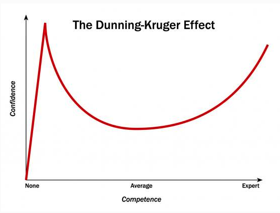
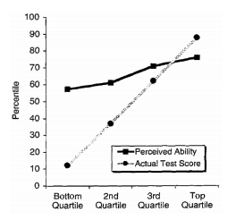
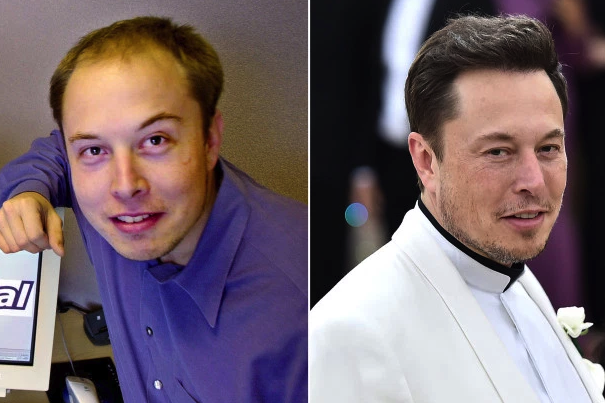
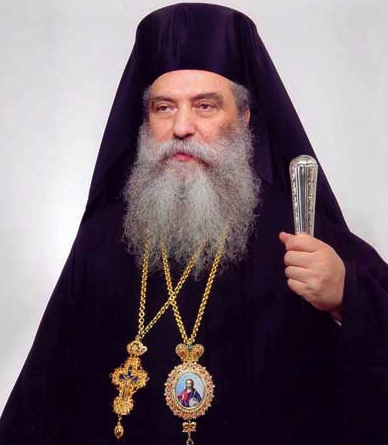
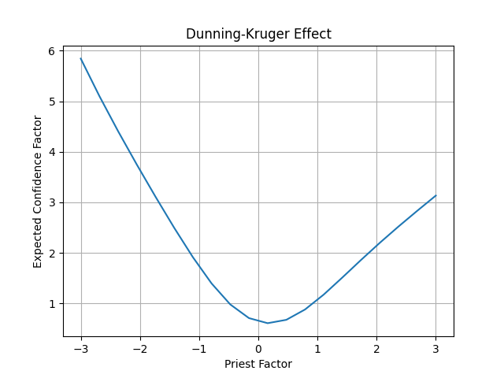

## Αυστηρός ορισμός του προβλήματος

Όλοι έχουμε βρεθεί σε μια παρέα στην οποία κάποιος φαίνεται να έχει απάντησεις για όλα τα θέματα. Έστω ότι τον λένε Μάκη. Ο Μάκης λοιπόν γνωρίζει απο διαστημική τεχνολογία, άρμεγμα της γίδας, διαφορική γεωμετρία σε πολλαπλότητες Calabi-Yau και οποιοδήποτε άλλο θέμα προκύψει πάνω στην κουβέντα. Όχι μόνο έχει απόψη αλλά μιλάει με την σιγουριά που θα εξηγούσε ένας νομπελίστας φυσικός κάποια θεωρία την οποία διατύπωσε ο ίδιος. Με ορατό τον κινδυνο να σε προσβάλλω και να σε χάσω απο πελάτη, θέλω να τονίσω ότι αν δεν αναγνωρίζεις κάποιον Μάκη στην παρέα σου είναι γιατί προφανώς ο Μάκης είσαι εσύ.

## Η επιστημονική εξήγηση

Που θέλω να καταλήξω με όλα αυτά; Πολύ απλά και λαικά, το φαινόμενο του άχρηστου μπετόβλακα ο οποίος θεωρεί ότι ξέρει τα πάντα έχει ονομασία: Φαινόμενο Ντάνινγκ–Κρούγκερ. Απο την πάντα αξιόπιστη wikipedia:

> Το φαινόμενο Ντάνινγκ–Κρούγκερ είναι μια γνωστική διαταραχή στην οποία άτομα περιορισμένων δεξιοτήτων αποκτούν μια ψευδαίσθηση ανωτερώτητας, εκτιμώντας εσφαλμένα οτι οι γνωστικές τους ικανότητες, είναι υψηλότερες από ό,τι πραγματικά είναι.

Επειδή σε ότι κάνω χρησιμοποιώ αποκλειστικά την επιστημονική μέθοδο, το έψαξα αρκετά και τελικά κατάλαβα ότι ο ακαδημαικός Ντάνινγκ–Κρούγκερ είναι δύο διαφορετικοί άνθρωποι. Χωρίς να θέλω να κάνω τον έξυπνο, είναι πολυ λογικό γιατι υπάρχει η "-" ανάμεσα στα ονόματα. Έχεις δει ποτέ να γράφουμε Ζαν-Κλοντ-Βαν-Νταμ; Τέλος πάντων οι Ντάνινγκ–Κρούγκερ δεν μελέτησαν μόνο τους ηλίθιους αλλά και τους έξυπνους:

> Άτομα υψηλής ειδίκευσης μπορεί να υποτιμούν τη δική τους σχετική ικανότητά και μπορεί εσφαλμένα να υποθέτουν ότι τα καθήκοντα τα οποία είναι εύκολα για αυτούς είναι επίσης εύκολα για τους άλλους.

Το ζουμί της ιστορίας είναι το παρακάτω γράφημα:



Άρα βλέπουμε ότι αρχικά ο άχρηστος δεν ξέρει ούτε το όνομά του και προφανώς έχει μηδέν αυτοπεποίθηση. Με το που θα μάθει δύo πράγματα, η αυτοπεποίθησή του γρήγορα μέγιστοποιείται. Όταν λέω δύο πράγματα εννοώ να ανοίγει μια κονσέρβα ή να αλλάζει κανάλι. Αισθάνεται αυθεντία. Αν τελικά αποφασίσει να μάθει κάτι παραπάνω τότε καταλαβαίνει ότι δεν έχει ιδέα και δεν νιώθει σιγουριά για τις ικανότητές του. Στα δεξιά της καμπύλης ανήκουν οι πραγματικές αυθεντίες, όπως είναι ο Άδωνις Γεωργιάδης ή ο Νίκος Καρβέλας. Έχουν μπόλικη αυτοπεποίθηση αλλά σαφώς μικρότερη από αυτή που διαθέτει ο γκασμάς.

Υποτίθεται ότι το γράφημα συνοψίζει με απλό τρόπο το φαινόμενο Ντάνινγκ–Κρούγκερ και αν το κοιτάξεις θα δείς ότι αναφέρεται σχεδόν σε όλα τα σχετικα άρθρα. Δυστυχώς ένα προβληματάκι
που έχει είναι ότι δεν βρίσκεται στις δημοσίευσεις των Ντάνινγκ–Κρούγκερ. Κάποιος το ζωγράφισε
στο Paint και οι υπόλοιποι το πίστεψαν. Ελπίζω δηλαδή, γιατί εγώ σίγουρα το πίστεψα. Εντάξει δεν πειράζει, ο σκοπός δεν είναι να δείξουμε τι ισχύει αλλά τι μας συμφέρει να ισχύει.
Να ένα πραγματικό γράφημα:



Το τελευταίο δείχνει ότι όσοι λένε κρυάδες θεωρούν ότι έχουν αρκετή πλάκα ενώ οι Σεφερλήδες υποτιμούν το πόσο αστείοι είναι. ΧΑΧΑΧΑΑΧΧΑΑΧ. Ξέσπασα.
Αντίστοιχα γραφήματα υπάρχουν και για άλλες δεξιότητες. Δηλαδή ο άχρηστος δεν θεωρεί ότι είναι αυθεντία αλλά ότι είναι καλύτερος απο το μέσο όρο.
Αυτό ακούγεται πιο λογικό σε σχέση με το προηγούμενο.

Μεταγενέστερες μελέτες ασκούν κριτική στα ευρήματα των Ντάνινγκ–Κρούγκερ εντοπίζοντας μεθοδολογικά λάθη και υποστηρίζουν ότι όλοι υπερεκτιμούν τις ικανότητές τους.
Δεν παραθέτω τις πηγές μου, αν δεν σου αρέσει πήγαινε να διαβάσεις το Νature. Πάντως το τελευταίο συμπέρασμα με βολεύει και θα το κρατήσω για τη συνέχεια.

Κλείνοντας θα ήθελα να σημειώσω ότι στους Ντάνινγκ–Κρούγκερ απονεμήθηκε το σατιρικό Ig Νόμπελ ψυχολογίας.
Δηλαδή οι Ντάνινγκ–Κρούγκερ μάλλον είχαν υπερεκτιμήσει την επιστημονική αξία του έργου τους. Φοβερό; Μόνος μου το σκέφτηκα.

## O Elon Musk

Ομολογώ ότι δυσκολεύτηκα να αποφασίσω για το εαν θα έπρεπε να γράψω αυτά που ακολουθούν. Άρχικα με τον Elon μας συνδέει μια βαθιά φιλιά και εκτίμηση. Μπορεί να μην
με ξέρει αλλά η καταγωγή μας είναι κοινή. Όχι, ο Elon δεν είναι Πυργιώτης αλλά γεννήθηκε και μεγάλωσε στην Νότια Αφρική. Είναι γνωστό επίσης ότι και ο Homo
sapiens έζησε στην Αφρική πριν απο 200.000 χρόνια. Αυτό.

Ο σημαντικότερος όμως ανασταλτικός παράγοντας για να ασκήσω κριτίκη στον Elon είναι οτι κάποια στιγμή στο μέλλον έχω δουλέψει σε μία απο τις εταιρίες του. Σε περίπτωση που η
προηγούμενη πρόταση δεν ακούγεται σωστή είναι γιατί αν θέλεις να συμβεί κάτι τότε το σύμπαν συνομώτει για να τα καταφέρεις. Αντίστροφα, αν δεν τα καταφέρεις είναι γιατί δεν συνομώτησε.
Τώρα αν ο Elon διαβάσει αυτό το άρθρο ενδέχεται να με αντιπαθήσει αλλά υποθέτοντας οτι τον πετυχαίνω στην ανάγκη, πιστεύω ότι θα αναγκαστεί να με προσλάβει στο μαγαζί του.
Το έχω δει να συμβαίνει live σε σουβλατζίδικο όταν ο ψήστης τσακώθηκε με το αφεντικό, παράτησε τα μπιφτέκια στη μέση αλλά μετά απο λίγο επέστρεψε για να συνεχίσει το ψήσιμο. Αν το καλοσκεφτείς και η Tesla ένα μεγάλο
σουβλατζίδικο είναι.

Όσοι απο τους αναγνώστες μου έζησαν τα εφηβικά τους χρόνια στα 90s σίγουρα θα θυμούνται τον Τζίμη τον Αλήθεια. Μια απο τις πλέον χαρακτηριστικές ιστορίες του είναι αυτή με τη μεγάλη φωτιά στο χωριό του. Κάποια στιγμή το πυροσβεστικό αεροπλάνο επιστρέφει για ανεφοδιασμό. Τότε μαζί με το νερό, παίρνει και έναν καρχαρία ο οποίος έτυχε να κολυμπάει στην περιοχή υδροληψίας. Ρίχνοντας το νερό στο φλεγόμενο χωριό, **ο καρχαρίας προσγειώνεται στο έδαφος και τρώει τα πρόβατα του παππού του**. Αν διαβάσει κανείς το Quora θα βρεί ιστορίες για τον Elon οι οποίες κάνουν το προηγούμενο σενάριο να μοιάζει σαν ένα αριστούργημα του σοσιαλιστικού ρεαλισμού. Μαθαίνουμε ότι υπήρξε παιδί θαυμα και μέχρι 2 ετών είχε διαβάσει ότι κυκλοφορούσε, δηλαδή απο τον κώδικα του Χαμουραμπί μέχρι κβαντική φυσική. Όταν τα υπόλοιπα παιδάκια έβλεπαν Thundercats αυτός διάβαζε Σιμόν ντε Μπoβουάρ. Αφου τα έμαθε όλα, άρχισε να εφαρμόζει τις γνώσεις του. Έφτιαξε απο μόνος του ένα video game, ένα μίξερ και ένα πολυόργανο Ηρακλής. Πήγε στο Stanford αλλά το παράτησε γιατί άκουσε το κάλεσμα απο τον ουρανό. Έπρεπε να σώσει την ανθρωπότητα. Δεν κοιμάται ποτέ, ίσως δεν τρώει. Ένας γραφικός Ινδός τον χαρακτήρισε ως metahuman. Τρέχει ταυτόχρονα 5000 projects και 10 εταιρείες. Φτιάχνει μπαταρίες, πυραύλους, είναι κοντά στην AI singularity και ετοιμάζεται να πεθάνει στον Άρη. Δεν έχει νόημα να συνεχίσω. Αυτός δεν είναι άνθρωπος. Το είπε εξάλλου ο Ινδός.



Όταν οι διάφοροι θαυμαστές του επαναλαμβάνουν συνεχώς τα παραπάνω με όλο και αυξανόμενη ένταση τότε είναι λογίκο να τα πιστέψει. Εδώ έχεις τη μάνα σου να λέει ότι είσαι το πιο όμορφο παιδάκι και τελικά το πιστεύεις, σκέψου να στο λένε άγνωστοι. Το αποτέλεσμα είναι αυτή η αηδία, η γελοιότητα, ο πιο εκνευριστικός κλαρινογαμπρός-εντερπρενέρ στο κόσμο, ο Elon Musk.

## Μαθηματικό μοντέλο

Ο Elon Musk λοιπόν είναι άλλος ένας άνθρωπος ο οποίος συστηματικά υπερεκτιμάει τις ικανότητές του. Προκλητικά αγνοεί τον παράγοντα τύχη και θεωρεί ότι είναι κλώνος του Νίκολα Τέσλα. Νομίζω ότι τώρα κάπως το έσωσα και το κούμπωσα με το φαινόμενο Ντάνινγκ–Κρούγκερ. Ευτυχώς γιατί είχα αρχίσει να ανησυχώ ότι θα χάσω το κοινό μου. Δεν είναι εκεί το θέμα όμως. Σκοπός μου είναι να δείξω πως με απλά μαθηματικά μπορεί κανείς να ποσοτικοποιήσει, σχεδόν να εξηγήσει, όλα τα παραπάνω.

Πρίν μπώ δυνατά στις λεπτομέρειες και στο φορμαλισμό του μαθηματικού μοντέλου θα ήθελα να κάνω μια σύντομη εισαγωγή. Πιο συγκεκριμένα θα προσπαθήσω να περιγραψω πως οδηγήθηκα σε αυτό γιατί σύχνα εμείς οι επιστήμονες δίνουμε την εντύπωση ότι οι ιδέες μας γεννιούνται στο κενό. Ένα ερώτημα το οποίο με βασάνιζε απο 2.5 μηνών ήταν ποιό στοιχείο διαφοροποιεί τον άνθρωπο απο τα ζώα. Δεν ισχυρίζομαι ότι είμαι ο πρώτος που το σκέφτηκε. Ας είμαστε σοβαροί. Όμως είμαι ο πρώτος που το έλυσε και μάλιστα πριν απο 40 χρόνια:

> Η θεμελιώδης διαφορά ανάμεσα στον άνθρωπο και στα ζώα (λιοντάρια, κουνέλια, κόμπρες, άλογα κτλ) είναι η παπάτζα.

Έχεις δει ποτέ ζώο να πουλάει παραμύθι; Θα προσπαθήσει ποτέ η αρκούδα να σε πείσει ότι μπορεί να σε φάει; Η χελώνα θα σου εξηγήσει με επιχειρήματα ότι είναι πιο γρήγορη απο εσένα; Κατάλαβες που το πάω; Αν όχι, δεν πειράζει. Οι μεγάλες ιδέες δεν γίνονται άμεσα κατανοητές.



Το μοντέλο μου λοιπόν ξεκινάει με την υπόθεση ότι η μόνη πραγματική δεξιότητα που υπάρχει στον άνθρωπο είναι η παπάτζα. Ομολογώ ότι είναι ισχυρή υπόθεση αλλά όπως είναι γνωστό:

> All models are wrong but some are useful.

Το γράφω στα αγγλικά γιατί το ίδιο στα ελληνικά δεν γράφει ωραία. Δίχως να χάνω χρόνο, προχωρώ στο notation. Ονομάζω ως $PF$ (Priest Factor) τον παράγοντα ο οποίος μετράει την ικανότητα ενός ατόμου στη παπάτζα και θεωρώ ότι παίρνει τιμές στο σύνολο των πραγματικών αριθμών. Υποθέτω ότι η αυτοπεποίθηση ενός ατόμου, την οποία ονομάζω $CF$ (Confidence Factor), εξαρτάται απο την αλληλεπίδρασή του με κάποια άλλα άτομα. Αυτό είναι λογικό αν το σκεφτείς. Πάντα συγκρίνεις τον εαυτό σου με τους άλλους. Είσαι κοντός γιατί οι άλλοι είναι ψηλοί. Είσαι όμορφος γιατί οι άλλοι είναι μπάζα κ.ο.κ. Στη ζωή όλα είναι σχετικά σύμφωνα με τον Einstein (ή τη γυναίκα του αν πιστέψουμε τις διάφορες θωρίες συνομωσίας).

Το κρίσιμο σημείο είναι ότι ο $CF$ ενός ατόμου είναι συνάρτηση του $PF$ του ίδιου ατόμου καθώς και των $PF_{i}$ των $i = 1, \cdots, n$ ατόμων με τα οποία αλληλεπιδρά. Ποιοτικά θα λέγαμε ότι αν βρέθεις σε μια παρέα στην οποία πουλάς τη μεγαλύτερη παπάτζα τότε όλοι σε πιστεύουν και η αυτοπεποίθησή σου πιάνει μέγιστο. Ομοίως αν είσαι ο ηλίθιος της παρέας, ή ισοδύναμα αυτός που έχει τη μικρότερη ικανότητα στο παραμύθι, τότε κανένας δεν σε πιστεύει και επειδή δεν το παίρνεις καν χαμπάρι (αφού οι υπόλοιποι σου πούλησαν το δικό τους ψέμα) πάλι έχεις μεγάλη σιγουριά για τον εαυτό σου. Το πρόβλημα εμφανίζεται όταν βρίσκονται στον ίδιο χώρο άτομα με αντίστοιχα επίπεδα παπάτζας. Τότε στην περίπτωση που είναι και οι δύο καλοί ψεύτες είναι αδύνατο να κοροιδέψει ο ένας τον άλλον. Αντίστοιχα εάν κανένας απο τους δύο δεν διαθέτει αυτή την ικανότητα τότε μένουν αποσβωλομένοι να κοιτούν με το χαρακτηριστικό βλέμα του πιγκουίνου περιμένοντας κάποιος να πεί το πρώτο ψέμα. Το αποτέλεσμα και στα δύο σενάρια είναι η χαμηλή αυτοπεποίθηση. Ποσοτικά η παραπάνω περιγραφή αντιστοιχεί στην εξής σχέση:

$$CF = \frac{1}{n} \displaystyle\sum_{i=1}^n | PF - PF_{i} |$$

δηλαδή η αυτοπεποίθηση ενός ατόμου είναι ίση με το άθροισμα των αποστάσεων ανάμεσα στη παπάτζα του και στην παπάτζα των υπολοίπων. Αυτό είναι πραγματικά deep result. Very deep.

Υποθέτω δίχως δισταγμό ότι ο $PF\_{i}$ για οποιοδήποτε απο αυτά τα ανεξάρτητα άτομα ακολουθεί μια τυποποιημένη κανονική κατανομή, δηλαδή:

$$PF_{i} \stackrel{i.i.d.}{\sim} N(0, 1)$$

Η ποσότητα που μας ενδιαφέρει είναι η αναμενόμενη τιμή του $CF$. Απο τις δύο προηγούμενες σχέσεις προκύπτει ότι ο $CF$ ακολουθεί τη λεγόμενη ως διπλωμένη κανονική κατανομή και συνεπώς:

$$E[CF] = \frac{2}{\pi} exp \Big( - \frac{PF}{2} \Big) - PF \cdot erf \Big( - \frac{PF}{\sqrt{2}} \Big)$$

όπου $erf$ η [συνάρτηση σφάλματος](https://en.wikipedia.org/wiki/Error_function).

Θα σχεδιάσω την αναμενόμενη τιμή $E[CF]$ ως συνάρτηση του $PF$ για τιμές γύρω απο το μηδεν και τρείς τυπικές αποκλίσεις. Το παρακάτω απόσπασμα κώδικα σε Python 3 παράγει το ζητούμενο γράφημα:

```python
# Imports
from scipy.special import erf
import numpy as np
import matplotlib.pyplot as plt

# Define expectation of confidence factors
def calculate_confidence_factors(priest_factors):
    values = (2.0 / np.pi) * np.exp(-priest_factors / 2)
    corrections = priest_factors * erf(-priest_factors / np.sqrt(2))
    return values - corrections

# Generate priest and confidence factors values
priest_factors = np.linspace(-3.0, 3.0, 20)
expected_confidence_factors = calculate_confidence_factors(priest_factors)

# Plot
fig, ax = plt.subplots()
ax.plot(priest_factors, expected_confidence_factors)
ax.set(
    xlabel='Priest Factor',
    ylabel='Expected Confidence Factor',
    title='Dunning-Kruger Effect'
)
ax.grid()
plt.show()
```



Η ομοιότητα με το υποτιθέμενο Ντάνινγκ–Κρούγκερ γράφημα είναι χωρίς υπερβολές ανατριχιαστική. Απο την συγκίνηση δυσκολέυομαι να γράψω ακόμα και τον επίλογο αυτού του άρθρου. Θα χαρακτήριζα την ανακάλυψη του μοντέλου ως μια μεταφυσική εμπειρία η οποία με άλλαξε ως άνθρωπο. Συγκεκριμένα μου προκάλεσε μια αστρική προβολή η οποία με ταξίδεψε στα όρια του γαλαξία μας. Ας αφήσω καλύτερα τις λεπτομέρειες για ένα επόμενο άρθρο.
