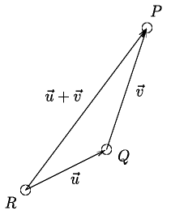

# Introduction

It is common to define the physical space as $\mathbb{R}^3$. This is incorrect both mathematically and physically. The reason is
that the structure of $\mathbb{R}^3$ is not invariant under displacements and under other physically important transformations
called isometries, in contrast to the nature of Euclidean geometry’s results. The three-dimensional space and the temporal axis of
Classical Physics (but also four-dimensional spacetime in Special Relativity) are first of all affine spaces.

# Definition of an affine space

A real affine space of finite dimension $n$ is a set $\mathbb{A}^n$ whose elements are called points equipped with the following
structures:

- A $n$-dimensional vector space $V$ called space of displacements or space of free vectors.
- A map $\mathbb{A}^n \times \mathbb{A}^n \ni(P, Q) \mapsto P-Q \in V$ with the following two properties:
    - For any pair $Q \in \mathbb{A}^n, \mathbf{v} \in V$ there is a unique $P \in \mathbb{A}^n$ such that $P-Q=\mathbf{v}$.
    - For any triplet $P, Q, R \in \mathbb{A}^n$, the identity $P-Q+Q-R=P-R$ holds.

If $Q \in \mathbb{A}^n$ and $\mathbf{v} \in V$ then the unique point $P$ in $\mathbb{A}^n$ such that $P-Q=\mathbf{v}$ is denoted
as $Q+\mathbf{v}$.

# Lines and line segments

We define a line and a line segment in $\mathbb{A}^n$ as follows:

- A line in $\mathbb{A}^n$ with origin $P$ and tangent vector $\mathbf{v} \in V$ is the map $\mathbb{R} \ni t \mapsto P+t
\mathbf{u} \in \mathbb{A}^n$.
- A line segment in $\mathbb{A}^n$ is a restriction of the above map to some interval.

# Various properties

The following properties hold for any $P, Q \in \mathbb{A}^n$ and $\mathbf{u}, \mathbf{v} \in V$:

- $P-P=\mathbf{0}$.
- $(Q+\mathbf{u})+\mathbf{v}=Q+(\mathbf{u}+\mathbf{v})$.
- $P-Q=-(Q-P)$.
- $P-Q=(P+\mathbf{u})-(Q+\mathbf{u})$.

> Prove the above properties.

# Coordinate systems

A local coordinate system on $\mathbb{A}^n$ is a map $\psi: U \subset \mathbb{A}^n \rightarrow \mathbb{R}^n$ with the following properties:

- $\psi$ is injective.
- $\psi(U) \subset \mathbb{R}^n$ is an open set.

The coordinate system is global if $U=\mathbb{A}^n$.

Every affine space admits a family of global coordinate systems called Cartesian coordinate systems. A Cartesian coordinate system
with origin $O$ and axes $\mathbf{e}_1, \ldots, \mathbf{e}_n$ is defined as follows:

- Fix a point $O$ and a basis $\mathbf{e}_1, \ldots, \mathbf{e}_n$ of $V$.
- Define a map $f: \mathbb{A}^n \rightarrow \mathbb{R}^n$ with $f(P) = \left((P-O)^1, \ldots,(P-O)^n\right)$

> Prove the above map is bijective and therefore $f$ is a global coordinate system.

Non-Cartesian local coordinate systems are called curvilinear coordinate systems.

# Properties of cartesian coordinate systems

Let $\left(\mathbb{A}^n, f\right)$ be a Cartesian coordinate system with coordinates $x^1, \cdots, x^n$
and $\left(\mathbb{A}^n, g\right)$ another Cartesian coordinate system with coordinates $x^{\prime 1}, \cdots, x^{\prime n}$,
origin $O^{\prime}$ and axes $\mathbf{e}^{\prime}{ }_1, \ldots, \mathbf{e}_n^{\prime}$, so that

$$
\mathbf{e}_i=\sum_j B^j{ }_i \mathbf{e}^{\prime}{ }_j
$$

Let $\left(O-O^{\prime}\right)=\sum_i b^i \mathbf{e}_i$ then the following properties hold:

- The map $g \circ f^{-1}: \mathbb{R}^n \rightarrow \mathbb{R}^n$ is expressed in coordinates as $x^{\prime j}=\sum_{i=1}^n B^j{
}_i\left(x^i+b^i\right)$.

-  The map $f \circ g^{-1}: \mathbb{R}^n \rightarrow \mathbb{R}^n$ is expressed in coordinates as
$x^i=-b^i+\sum_{j=1}^n\left(B^{-1}\right)^i{ }_j x^{\prime j}$.

> Prove the above properties.

# Affine transformations

A map $\psi: \mathbb{A}_1^n \rightarrow \mathbb{A}_2^m$ between affine spaces $\mathbb{A}_1^n$ and $\mathbb{A}_2^n$ with spaces of
displacements $V_1$ and $V_2$ is called an affine transformation and has the following properties:

- $\psi$ is invariant under displacements i.e. $\psi(P+\mathbf{u})-\psi(Q+\mathbf{u})=\psi(P)-\psi(Q)$ for any $P, Q \in
\mathbb{A}_1^n$ and $\mathbf{u} \in V_1$.
- The map $d \psi: V_1 \rightarrow V_2$ with $d \psi(P - Q) = \psi(P) - \psi(Q)$ is a linear between the vector spaces $V_1$ and
$V_2$.

> Prove the map is well defined and linear.

An affine transformation is called an isomorphism of affine spaces if it is bijective. Note that the inverse of an isomorphism of
affine spaces is an affine map and hence an isomorphism of affine spaces. If $\psi: \mathbb{A}_1^n \rightarrow
\mathbb{A}_2^n$ is an isomorphism of affine spaces then $d \psi: V_1 \rightarrow V_2$ is a vector space isomorphism.

> Prove the above properties.

Affine transformations map straight lines to straight lines: If $\psi: \mathbb{A}_1^n \rightarrow \mathbb{A}_2^n$ is affine and
$P(t):=P+t \mathbf{u}$, with $t \in \mathbb{R}$, is the line in $\mathbb{A}_1^n$ with origin $P$ and tangent vector $\mathbf{v}
\in V_1$, then $\psi(P(t))$, as $t \in \mathbb{R}$ varies, defines a line in $\mathbb{A}^m$.

> Prove the above properties.

# Representation of affine transformations

Let $\psi: \mathbb{A}_1^n \rightarrow \mathbb{A}_2^m$ an affine transformation. Then, for any choice of Cartesian coordinate
systems in the two spaces $\left(\mathbb{A}_1^n, f_1\right)$ and $\left(\mathbb{A}_2^m, f_2\right)$, the representation of $\psi$
in coordinates, i.e. the map $f_2 \circ \psi \circ f_1^{-1}: \mathbb{R}^n \ni\left(x_1^1, \ldots, x_1^n\right) \mapsto\left(x_2^1,
\ldots, x_2^m\right) \in \mathbb{R}^m$ has the form

$$x_2^i=c^i+\sum_{j=1}^n L^i{ }_j x_1^j \quad(i=1,2, \ldots, m)$$ 

> Prove the above property.

for suitable coefficients $L^i{ }_j$ and $c^i$ depending on $\psi$ and on the coordinate systems. Above, $\left(x_2^1, \ldots,
x_2^m\right)$ are the Cartesian coordinates of $\psi(P) \in \mathbb{A}_2^m$ and $\left(x_1^1, \ldots, x_1^n\right)$ those of $P
\in \mathbb{A}_1^n$.

Conversely, $\psi: \mathbb{A}_1^n \rightarrow \mathbb{A}_2^m$ is affine if there exist Cartesian coordinate systems on the two
spaces in which $\psi$ has the above form in coordinates.

> Prove the above property.

# Group of displacements

The mapping $T_{\mathbf{v}}: \mathbb{A}^n \rightarrow \mathbb{A}^n$ of $\mathbf{v} \in V$ on $\mathbb{A}^n$ is defined as
$T_{\mathbf{v}}: P \mapsto P+\mathbf{v}$.

The set $\left\{T_{\mathbf{v}}\right\}_{\mathbf{v} \in V}$ is a group under composition, called the group of
displacements of $\mathbb{A}^n$. As $T_{\mathbf{u}} T_{\mathbf{v}}=T_{\mathbf{u}+\mathbf{v}}$ and
$\mathbf{u}+\mathbf{v}=\mathbf{v}+\mathbf{u}$, the group is Abelian.

> Prove the above properties.

The following properties hold:

- The map $V \ni \mathbf{v} \mapsto T_{\mathbf{v}}$ is injective. It is a group isomorphism when we view $V$ as Abelian group
under addition.
- Only $\mathbf{v}=\mathbf{0}$ satisfies $T_{\mathbf{v}}(P)=P$ for some $P \in \mathbb{A}^n$, i.e. the action of the
group of displacements is free. We also have the stronger condition $T_0(P)=P$ for any $P \in \mathbb{A}^n$.
- For any pair $P, Q \in \mathbb{A}^n$ there is a displacement $T_{\mathbf{v}}$ such that $T_{\mathbf{v}}(P)=Q$ i.e.
the group of displacements acts transitively.

> Prove the above properties.

# Group action

Given a set $S$, and a group $G$ with neutral element $e$ and product $\circ$, an action of $G$ on $S$ is a map $A: G \times S \ni(g, s) \mapsto$ $A_g(s) \in S$, where $A_g \in \mathcal{G}_S$ and the latter is the group of bijections on $S$ under composition, such that:

- $A_e=i d$,
- $A_g A_{g^{\prime}}=A_{g \circ g^{\prime}}$ where $g, g^{\prime} \in G$.

We have the following definitions:

- The action is called free if $A_g(s)=s$ for some $s \in S$ implies $g=e$.
- The action is called transitive if for any $s, s^{\prime} \in S$ there exists $g \in G$ such that $A_g(s)=s^{\prime}$.
- The action is called faithful if $G \ni g \mapsto A_g \in \mathcal{G}_S$ is injective. 

An action always determines a group homomorphism $G \rightarrow \mathcal{G}_S$, and therefore $G_S:=\left\{A_g\right\}_{g \in G}$
is a subgroup of $\mathcal{G}_S$ and $A$ is faithful if and only if defines a group isomorphism $G \rightarrow G_S$.

> Prove the above properties.
